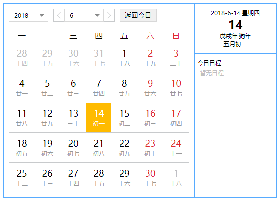

## 一个可以显示日程的日历组件

### 实现的功能
* 默认显示当前月份，并高亮显示今天(可关闭)。
* 可以通过年份和月份下拉选择来切换日历。
* 可以通过参数控制是否将哪天有日程以一个点的形式直接显示在日历当中。
* 可以通过点击日历中的日期来选择某一天，并在右侧显示其如果有的日程。
* 如果点击到了不在当前月份的日期会自动切换到对应的月份。
* 日历可以显示1900-2050的阴历和阳历每一天的数据以及生肖年、天干地支年。

### 目前留出的 @Input 参数
|参数名称|参数类型|参数功能|是否有默认值|
|-------|-------|-------|-------|
|width|number|整个组件宽度|550|
|scheduleList|ScheduleList注1[]|所提供的日程数据| -- |
|showSchedule|boolean|是否在日历中显示哪天有日程|false|
|scheduleIconColor|string('#xxxxxx' \| '#xxx' \| 'rgb(xx,xx,xx)')|如果需要在日历中显示哪天有日程，所显示的icon颜色|#fb0|
|showToday|boolean|是否高亮显示今天|true|
|defaultYear|number|默认显示的年份|当前日期的年份|
|defaultMonth|number|默认显示的月份|当前日期的月份|
|defaultDay|number|默写人显示的日期|当前日期的日期|
|updateDate|(selectDate: ISelectDate注2) => void|在发生日期变更的时候触发的函数|--|

    注1:
      interface ScheduleList {
        year: number;
        month: number;
        day: number;
        schedules: Schedule[];
      }
      interface Schedule {
        startTime: string;
        endTime: string;
        description: string;
        iconColor: string;
      }
    注2:
      interface SelectDate {
        year: number;
        month: number;
        day: number;
      }

### 预览

### PS
git clone ..... 之后 
- npm install 安装依赖
- ng serve (--open) 运行
- ng test 运行测试
